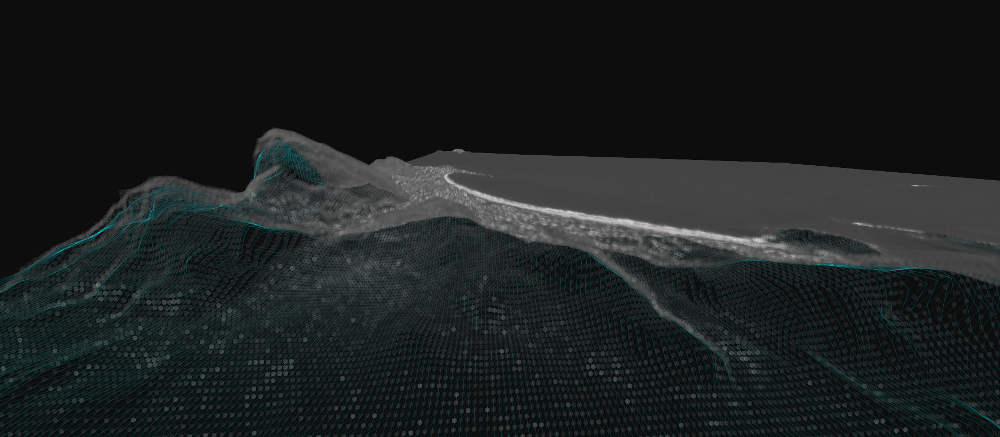
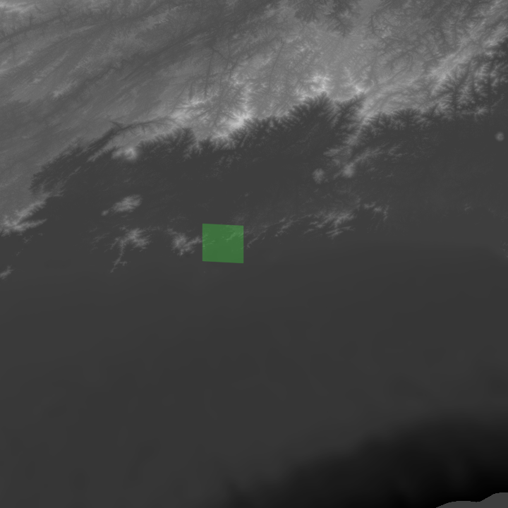
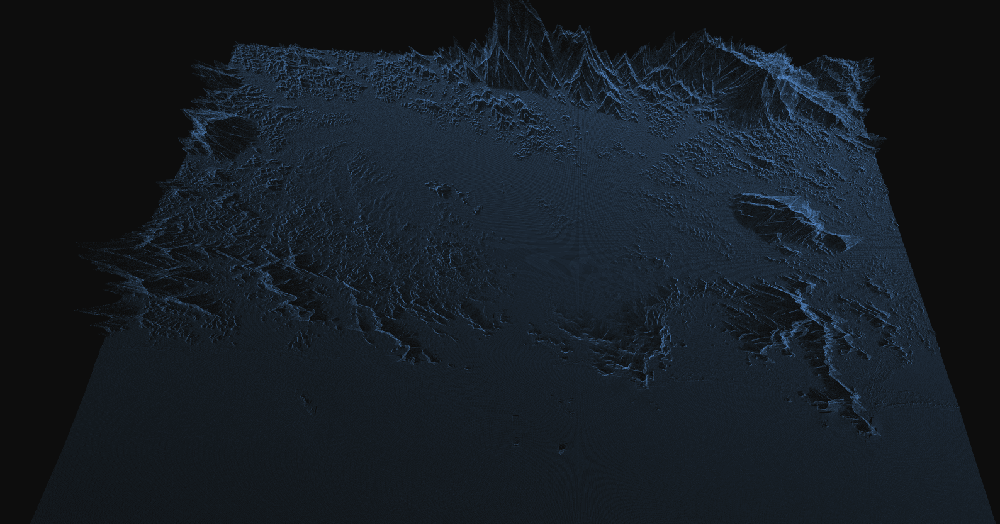
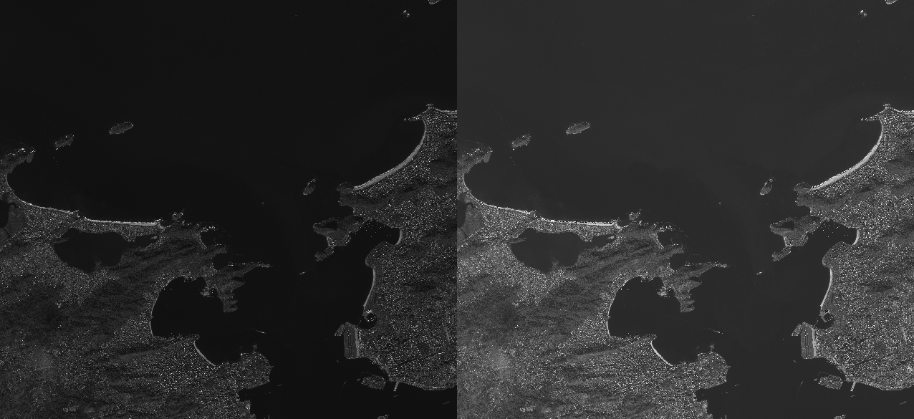

# Orthorectification Using RPCs

This repository houses some methods and utilities to help perform orthorectification on raw satellite imagery
such as worldview2/3/4(RIP) panchromatic imagery. 

These algorithms were presented as a deep dive in the Charlottesville Data Science Meetup, February 27th, 2020. 
The original presentation material is included under `/presentation`

Note that all of this functionality already exists in libraries like GDAL and others. The goal of this codebase
was to present and deep dive into these subroutines.

Nearly all of the code is Numba JIT-able for maximum performance. There is also a pure C++ implementation of 
the orthorectification routine that can be optionally imported using `cppyy`.  

# Functions

### ortho_tools.py

`def unpack_rpc_parameters(dataset: gdal.Dataset) -> RPCCoeffs:`

Returns RPC coefficients collection as a NamedTuple
when provided with a GDAL dataset if that dataset contains RPCs

`def retrieve_dem(
    min_lon: float,
    min_lat: float,
    degrees_lon: float,
    degrees_lat: float,
    sampling_rate: int = 1,
    output_path: str = "/tmp/elevation.dem",
) -> Tuple[np.ndarray, np.array]:`

Loads up a DEM tile given an upper-left world coordinate (min_lon, min_lat) and a width/height
in degrees.

The return object is a tuple containing the DEM image and its GeoTransform respectively.

`def lon_lat_to_pixel(lon: float, lat: float, geot: np.array) -> Tuple[float, float]:`

Reprojects a world coordinate into pixel space using a GeoTransform, (Array of 6 floats)
This is useful for querying DEM information, or finding an image pixel coordinate for an image
that has already been orthorectified.

`def linear_interp(x: float, y: float, source: np.ndarray, source_height: int) -> int:`
Given a pixel space coordinate x,y and a source image as a flattened array (with the stride!), 
returns a bilinearly interpolated measurement. Useful for DEM interpolation and also interpolation
during the orthorectification process.

`def lon_lat_alt_to_xy(
    lon: float,
    lat: float,
    alt: float,
    rpcs: RPCCoeffs,
) -> Tuple[float, float]:`

Returns an image pixel coordinate (x, y) corresponding to a provided world coordinate (lon, lat, alt) using provided RPC coefficients

`def make_ortho(
    x1: float,
    x2: float,
    y1: float,
    y2: float,
    width: int,
    source: np.ndarray,
    rpcs: RPCCoeffs,
    dem: np.ndarray,
    dem_geot: np.array,
) -> Tuple[np.array, float, float, float]:`
Creates an ortho with using the provided bounding box (x1, x2, y1, y2) which is `min_lon`, `max_lon`, `min_lat`, `max_lat`,
a desired width (number of pixels), a source image, that source image's RPCs, a DEM, and the DEM's affine GeoTransform.

### scaling_tools.py

`def fracture_polygon_north_up(poly: Polygon, factor_x: int, factor_y) -> Sequence[Polygon]:`
Breaks a Shapely polygon into small north up rectangles, attempts to fill as much area as possible
with smaller squares. The factors control the number of rectangles per dimension (resolution)

`def fracture_parallelogram(poly: Polygon, factor: int) -> Sequence[Polygon]:`
    
Fractures a parallelogram into smaller parallelogram with a non-regular orientation.
The orientation of each individual small parallelogram with respect to the original
parallelogram is maintained.

`def rescale_elevation_data(elevation_data: np.ndarray) -> np.ndarray:`
 Maps elevation data into a 0-255 8-bit representation that is suitable for viewing
    
`def reproject_with_affine(
    coords: Sequence[Tuple[float, float]],
    geo_transform: np.array,
    resize_factor: float = 1.0,
) -> Sequence[Tuple[float, float]]:`
Basically the same thing as `ortho_tools.lon_lat_to_pixel`, but works on a sequence of coordinates,
which can be exactly what you get out of a `shapely.Polygon.exterior.coords` for example. You can 
optionally pass in a `resize_factor` that rescales your result as desired.

`def overlay_polygon(
    img: np.ndarray,
    polygon: Polygon,
    color: Tuple[int, int, int, int] = (0, 255, 0, 0),
    opacity: float = 0.2
) -> np.ndarray:`

Burns a polygon onto an image using OpenCV. 
Example:

`def generate_triangle_mesh(elevation_data: np.ndarray, reach: int = 10) -> Tuple[np.array, np.array, np.array]:`
Generates a triangle mesh from elevation data using a very simple and non-optimal but extremely fast procedure
Produces a 3D vertex list as a Tuple of np.array. The resulting data can be visualized using OpenCV or something like that.

### io_tools.py

`def save_raster_as_geotiff(ortho: np.ndarray, ul_lon: float, ul_lat: float, gsd: float, filename: str) -> None:`
You provide an image, it's upper left world coordinate (ul_lon, ul_lat), and its GSD (ground sampling distance) in degrees,
and it writes out a mapping compatible GeoTIFF file. This can be imported into QGIS/ArcGIS or whatever to 
visualize the ortho product on a map.

### scaling_tools.py
`def resize(img: np.array, factor: int) -> np.array:`
OpenCV resize

`def convert_to_8bit(img: np.array) -> np.array:`
Jams higher bitness image pixels into 0-255 range... not elegant.

`def gaussian_rescale(img: np.array, bitness=11, stdev_bound=3) -> np.array:`
Much more elegant way to rescale a >8 bitness image into 0-255 range. Bitness of the 
image must be provided. WV3 is usually 11 or 12 bit.

See a before and after example:

### experimental.py

Only use this if you are brave. Requires `cppyy` which can be a pain to install, so it is not marked as a required package.

`def ortho_cpp(
    x1: float,
    x2: float,
    y1: float,
    y2: float,
    width: int,
    rpcs: RPCCoeffs,
    source: np.ndarray,
    dem: np.ndarray,
    dem_geot: np.array,
):`

This is the exact same method signature as `ortho_tools.make_ortho`, but it uses pure C++ code as an
accelerated version. Generally about twice as fast as even the `Numba` JITted version of `ortho_tools.make_ortho`

Coming soon to `experimental.py`: 
Orthorectify your RPC images with CUDA!

